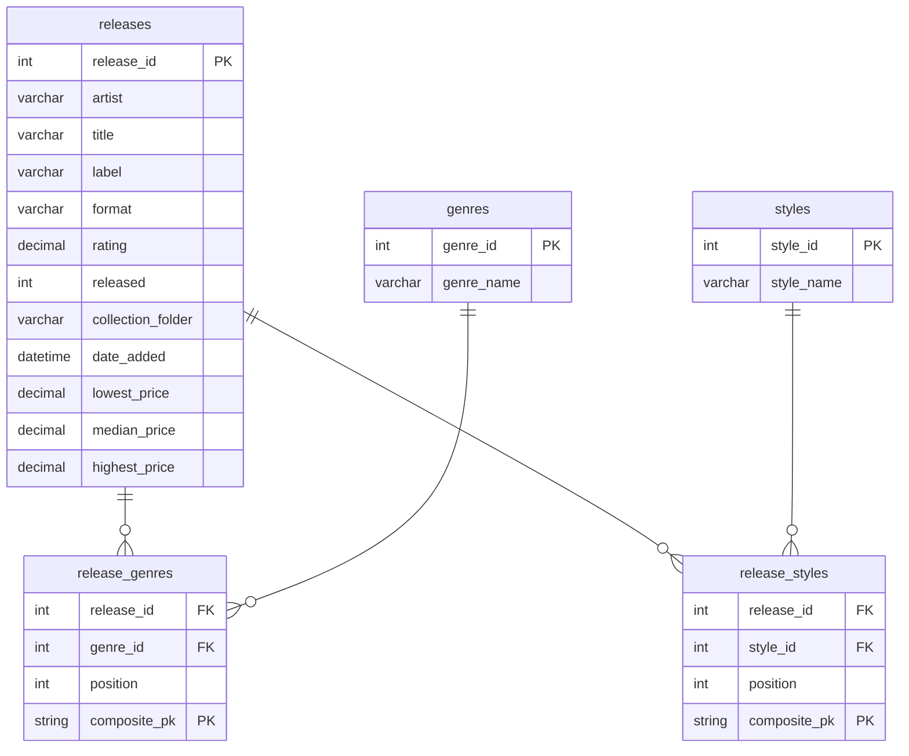

# 🎵 Discogs Vinyl Collection Analysis

This project documents my process of converting my personal vinyl record collection into a structured database and analyzing its characteristics using R, SQL, and Tableau. The goal is to gain insights into the collection's genre distribution, value, and other trends.

## 🛠️ Key Technologies

* **R:** For data extraction from the Discogs API, data cleaning, and data transformation.
* **Discogs API:** For programmatically retrieving genre and style information.
* **Excel:** For manual data cleaning and transformation.
* **SQL (MySQLWorkbench):** For creating a relational database, loading data, and performing exploratory data analysis [EDA].
* **Tableau (Coming soon...):** For creating interactive visualisations of the collection.

## 💾 Data Sources

* **Discogs Export:** A CSV export of my collection from Discogs, containing basic record information.
* **Discogs API:** Used to retrieve genre and style information based on release IDs.
* **Manual Price Data:** Manually collected data on record values (low, median, high) from the Discogs marketplace.

## 📊 Data Processing Workflow

1.  **Collection Export:** My vinyl collection was exported from Discogs as a CSV file.
2.  **Genre Data Retrieval (R):** An R script (`discogs_api_genre_scrape.R`) was used to query the Discogs API and retrieve genre and style information for each record.
3.  **Data Normalization (R):** The retrieved data was further normalised using R scripts (`discogs_data_normalize.R`) to create a relational database structure.
4.  **Database Creation and Loading (SQL):** A MySQL database was created using the `discogs_db_setup.sql` script, and the CSV data was loaded into the database tables.
5.  **Price Data Merging (R):** Manually collected price data was merged with the main dataset using an R script (`discogs_merge_prices.R`).
6.  **Data Analysis (R/SQL):** R and SQL queries were used to analyse the collection's characteristics.
7.  **Visualisation (Tableau - Future):** (Planned) Interactive visualisations will be created in Tableau to explore the data.

## 🗄️ Database Schema



## 🔍 Example SQL Queries

```sql
-- What are the top 5 most frequent primary genres?
SELECT genre_name, COUNT(*) AS genre_count
FROM discogs_genres dg
JOIN discogs_release_genres drg ON dg.genre_id = drg.genre_id
WHERE drg.position = 1
GROUP BY genre_name
ORDER BY genre_count DESC
LIMIT 5;

-- What is the average median value of records in the "Jazz" genre?
SELECT AVG(d.median) AS avg_jazz_value
FROM discogs_export d
JOIN discogs_release_genres drg ON d.release_id = drg.release_id
JOIN discogs_genres dg ON drg.genre_id = dg.genre_id
WHERE dg.genre_name = 'Jazz';

-- (More examples to be added...)
```

